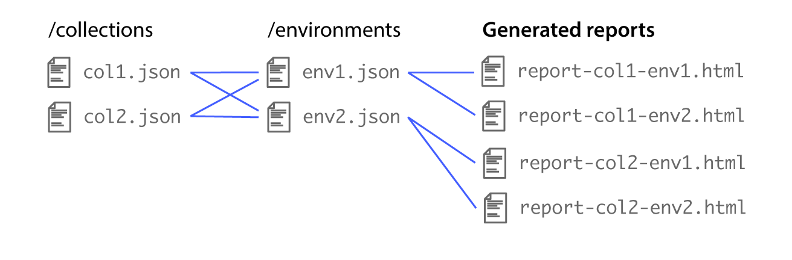

# Azure + Newman: A Test Harness

Let’s start with the problem. We have a big application that we want to break up into smaller more manageable pieces; decompose the monolith, if you will. To do this, we'll be creating microservices on Kubernetes. Understanding this new system from your customers’ perspective is a good thing. Our customer in this scenario will be consuming APIs. We'd like to provide a nice gateway to the data and bolt on some security. To do this we'll use an API Gateway and a WAF.

We'd like to understand how each component of the system affects response time. To accomplish this, we'll create three environments:

- Kubernetes => Microservice
- Kubernetes => API Gateway => Microservice
- WAF => Kubernetes => WAF => API Gateway => Microservice

To understand the difference in response time each layer adds, we need a tool that times the request/response call. [Postman](https://www.getpostman.com/) sounds like a logical tool to use, but it's GUI based and not suitable for automating in a CI/CD environment. That's where [Newman (from Postman)](https://www.getpostman.com/docs/v6/postman/collection_runs/command_line_integration_with_newman) comes in. Newman is the CLI version of Postman and maintains feature parity with it's GUI counter part.

There is one other piece to this equation. We'd like to test the request/response time on the local network to prevent the interwebs from adding latency. 

Azure will run our different environments. We'll have a Kubernetes cluster created using Azure Kubernetes Sercice (AKS). This creates a VNet. On this VNet we'll also create an Azure <abbr title="virtual machine">VM</abbr>. This <abbr title="virtual machine">VM</abbr> will run Newman against our different AKS environments stated above. 

The code to setup our test harness is here: [iphilpot/newman-test-harness](https://github.com/iphilpot/newman-test-harness)

# Getting started

This will only deploy the request Test Harness using [Newman (from Postman)](https://www.getpostman.com/docs/v6/postman/collection_runs/command_line_integration_with_newman). It creates a VM and a storage account to the specified resource group/vnet. This does not create the AKS instance or a microservice for testing against.

## Local Machine prerequisites

 - [AzureCLI](https://docs.microsoft.com/en-us/cli/azure/install-azure-cli?view=azure-cli-latest)
 - Bash
 - Git

## Steps

1. Login to Azure (`az login`).
2. Clone the repo.
3. Modify the environment variables in the `/.env.sample` file, and configure them to your specific environment.
    - The important ones are `AZ_RESOURCE_GROUP` and `AZ_EXPIRY`. The others can be arbitrary names.
4. Save that `.env.sample` file as `.env` (which is `.gitignore`-d in the repo, so it won't be accidentally committed).
5. Run `sh deployHarness.sh`.

Here's what's happening in the shell script (with the settings provided in `.env`):
    - Create an Azure storage account and container
    - Upload the collection and environment files in `/collections` and `/environments` (see below for more info)
    - Upload the necessary report generation scripts
    - Create the test harness VM to the specified resource group
    - Execute the `newman.sh` script inside the repo to generate the reports
    - Setup a watcher to watch for files uploaded to `/collections` and `/environments` (see below for more info)
    - Echo a link to a webpage that contains links to the generated reports (in the form of, e.g., `http://123.123.123.123/reports.html`)
    
The **`/collections`** folder contains [Postman collections](https://www.getpostman.com/docs/v6/postman/collections/creating_collections), which you can generate from Postman. The filenames don't matter, but are used in the generated report links.

The **`/environments`** folder contains [Postman environments](https://www.getpostman.com/docs/v6/postman/environments_and_globals/manage_environments) which can also be exported from Postman. The filenames are also used in the generated report links.

The `newman.sh` script will _watch_ for those collections/environments files uploaded to the storage account. When files are uploaded, reports will be regenerated, which you can view by reloading that same link (e.g., `http://123.123.123.123/reports.html`). There are [other ways](https://docs.microsoft.com/en-us/azure/storage/blobs/storage-blob-event-overview) to accomplish this, but we went with the simplest solution for now.

The general idea is that each collection in `/collections` will contain links to the endpoints you want to test, with environment variables such as `https://{{host}}/some/api/endpoint`. Each environment file in `/environments` will be used to populate that `{{host}}` variable, and generate a report for each environment.

As a result, every time a new collection and/or environment file is uploaded to the storage container, the reports will be regenerated. Currently, HTML reports are created, but this can be adapted so that JSON reports are produced instead, which can be consumed through an API.

Below is an illustration of how the combination of collection and environments files creates the various reports that can be compared:

